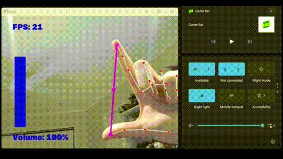

# 🖐️ Hand Gesture Volume Control

Control your Windows system volume in real time using just your hand — no keyboard, no mouse. A webcam tracks your hand with [MediaPipe](https://google.github.io/mediapipe/), measures the distance between your thumb and index finger, and maps that distance directly to your system's volume level.

Built with **Python**, **OpenCV**, and **MediaPipe**.



## How it works

1. **`HandTrackingModule.py`** — a reusable module that wraps MediaPipe's hand-landmark detector. It finds a hand in each webcam frame and returns the pixel position of all 21 hand landmarks.
2. **`VolumeHandControl.py`** — the main script. It:
   - Grabs landmark positions for the thumb tip (`#4`) and index fingertip (`#8`)
   - Calculates the distance between them
   - Maps that distance to the system's volume range using [`pycaw`](https://github.com/AndreMiras/pycaw) (Python Core Audio Windows Library)
   - Draws a live volume bar and FPS counter on the video feed
3. **`HandTrackingMinimum.py`** — a minimal standalone demo of just the hand-tracking piece, useful for testing that MediaPipe/OpenCV are working before running the full volume control script.

Pinch your fingers together to lower the volume, spread them apart to raise it.

## Requirements

- Windows (the volume control relies on the Windows Core Audio API via `pycaw`)
- A webcam
- Python 3.9–3.12

> **Note on versions:** This project intentionally pins older versions of `mediapipe` and `pycaw`. Newer releases of both libraries changed their APIs in breaking ways (MediaPipe dropped the legacy `solutions` API in 1.x, and pycaw wrapped its device objects differently), so pinning keeps the code in this repo working as-is.

## Setup

**1. Clone the repository**

```bash
git clone https://github.com/Jordo09123/Hand-Gesture-Volume-Control-.git
cd Hand-Gesture-Volume-Control-
```

**2. (Recommended) Create a virtual environment**

```bash
python -m venv venv
venv\Scripts\activate
```

**3. Install dependencies**

```bash
pip install "mediapipe==0.10.14"
pip install opencv-python
pip install numpy
pip install "pycaw==20181226"
pip install comtypes
```

| Package | Version | Why pinned |
|---|---|---|
| `mediapipe` | `0.10.14` | Last release with the legacy `mp.solutions.hands` API this project uses |
| `pycaw` | `20181226` | Returns the raw COM pointer from `AudioUtilities.GetSpeakers()` that `.Activate()` expects |
| `opencv-python` | latest | Webcam capture and drawing |
| `numpy` | latest | Mapping hand distance to volume range (`np.interp`) |
| `comtypes` | latest | COM interop used by `pycaw` |

## Usage

Run the main script:

```bash
python VolumeHandControl.py
```

- A window will open showing your webcam feed with hand landmarks drawn on top.
- Move your **thumb** and **index finger** closer together or further apart to lower/raise the volume.
- A blue bar on the left shows the current volume level as a percentage.
- Press any key while the video window is focused, or close the window, to stop the script.

To just test hand tracking without volume control:

```bash
python HandTrackingMinimum.py
```

## Troubleshooting

- **`AttributeError: module 'mediapipe' has no attribute 'solutions'`** — you have a newer mediapipe version installed. Run `pip install "mediapipe==0.10.14"`.
- **`AttributeError: 'AudioDevice' object has no attribute 'Activate'`** — you have a newer pycaw version installed. Run `pip install "pycaw==20181226"`.
- **`NameError: name 'IAudioEndpointVolume' is not defined`** — make sure it's imported alongside `AudioUtilities`: `from pycaw.pycaw import AudioUtilities, IAudioEndpointVolume`.
- **No webcam feed / black window** — check that no other application is using your webcam, and that `cv2.VideoCapture(0)` matches your webcam's device index.

## Credits

Based on the [Gesture Volume Control](https://www.youtube.com/watch?v=9iEPzbG-xLE) tutorial by Murtaza's Workshop - Robotics and AI.
